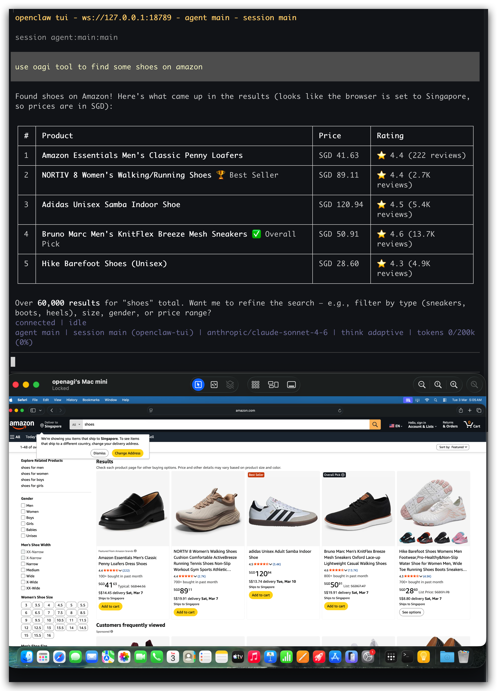

# OAGI Computer Use — OpenClaw Plugin

Desktop automation via the [OAGI Lux](https://developer.agiopen.org) computer-use model.



## Install

```bash
openclaw plugins install @oagi/openclaw-computer-use
```

After installing, you **must** build the native dependencies (see [Native Dependencies](#native-dependencies) below).

## Prerequisites

- **API Key**: Get one at <https://developer.agiopen.org>. Set via `OAGI_API_KEY` env var or plugin config.
- **macOS**: Grant Accessibility permission to your terminal (System Settings > Privacy & Security > Accessibility).
- **Linux**: Install X11 dev headers (`sudo apt install libx11-dev libxtst-dev`).

## Native Dependencies

This plugin requires `robotjs` (screen capture and input simulation), which is a native C++ module that must be compiled for your platform. OpenClaw's plugin installer skips build scripts for security, so **you need to build robotjs manually after install**:

```bash
cd ~/.openclaw/extensions/openclaw-computer-use/node_modules/robotjs
npx node-gyp rebuild
```

You should see `gyp info ok` at the end. If the build fails:

- **macOS**: Make sure Xcode Command Line Tools are installed (`xcode-select --install`).
- **Linux**: Install build dependencies (`sudo apt install build-essential libx11-dev libxtst-dev`).

To verify robotjs is working:

```bash
cd ~/.openclaw/extensions/openclaw-computer-use
node -e "require('robotjs'); console.log('robotjs OK')"
```

## Configuration

| Key           | Default                   | Description                   |
| ------------- | ------------------------- | ----------------------------- |
| `apiKey`      | `$OAGI_API_KEY`           | OAGI API key                  |
| `baseUrl`     | `https://api.agiopen.org` | API base URL                  |
| `model`       | `lux-actor-1`             | Model ID                      |
| `maxSteps`    | `20`                      | Max steps per task            |
| `temperature` | `0.5`                     | Sampling temperature          |
| `stepDelay`   | `1.0`                     | Delay between steps (seconds) |

## Development

Clone and install for local development:

```bash
git clone https://github.com/agiopen-org/openclaw-oagi.git
cd openclaw-oagi
npm install
```

Then load as a local extension in OpenClaw by adding the path to `plugins.load.paths` in your OpenClaw config.

## License

MIT
